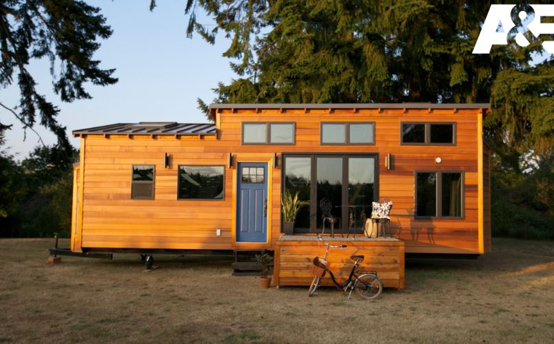

(<https://www.youtube.com/watch?v=BJDYlJaMuv>)

Container: (<https://www.pocketcontainer.de/open_side_40_ft.php>)


- Karosserie KLeber
- Schlagschnur
- Platte Siebdruckplatten, wasserfest
- QUellband_ abdichtung, winddicht

- Rahmen für die Wände
- wasser fester Leim, schäumt auf
- 4m hoch,3,25 ist die Kabine hoch; 7,50 m lang, 2,55 breit
- 2,50 ist das Bett, 2 meter ist das Bett hoch

- erlaubt 2,55 meter breite, 4 meter höhe, 12 meter länge

- Vorgaben für eine Straßenzulassung
- 3 SChicht platte
- Fichte und Pappel, leicht

- DIagonalen der Grundfläche Messen- müssen gleich lang sein
- Diagonale: 7,67
- 10m2 große platte _ 70 kg
- 2 übereinander
- später ausschneiden
- an den stößen, also dort wo latten die Platten aufeinander treffen werden von außen latten angeklebt
- mit Konstruktionskleber verbunden
- hält auch wenn es mal vibriert, bis - 40 Grad Celsius
- Bad ist 1,20 breit
- Konstruktionskleber
- Wände werden mit Holzwolle isoliert
- diffusionsoffene Folie, feuchtigkeit raus. aber keine rein
- auf die Folie kommen Latten zur Hinterlüftung- Luft Zirkulation zwischen Unterspannbahn und AUßenverkleidung
- QUellband auch für die Fenster
- Fenster Türen, welche nach außen aufgehen
- FOrmfedern
 Klicksystem mit Plastikverbindern für die Treppe
- Duchbereich PVC verkleiden. Fliesen zu schwer
- Wärmebegleitheizung ABwasser
- Resol Hartschaumplatten
- 80 mm PUR Hartschaumplatten
- Multiplex Platten


```{r, echo=FALSE}
img_path <- "tiny_houses/pictures"

```


```{r eval=TRUE, echo=FALSE}
knitr:: 
```


- alles

